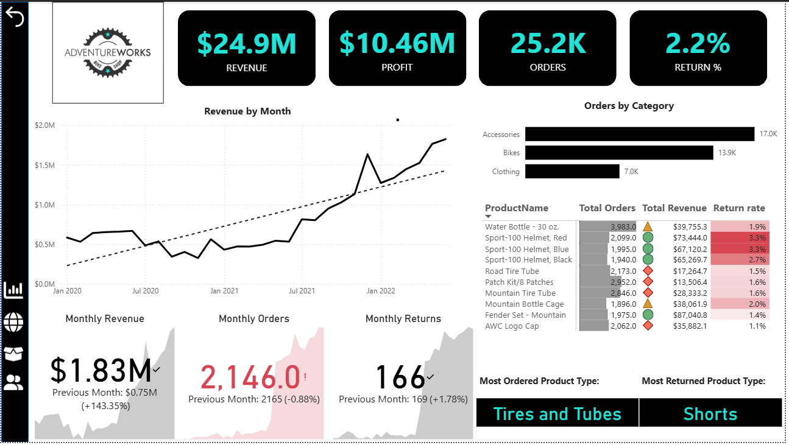
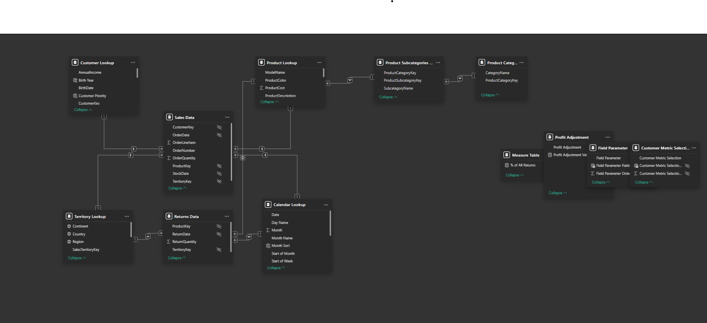

<!-- PROJECT BANNER -->
<p align="center">
  
</p>

<h1 align="center">🚴‍♂️ Adventure Works KPI Dashboard — Power BI Project</h1>
<h3 align="center">By <a href="https://www.linkedin.com/in/devesh-g-40430a253/">Devesh G</a></h3>

<p align="center">
  <a href="https://github.com/deveshd003-dj/Adventure-Works-KPI-Dashboard">
    
  </a>
  <a href="https://www.linkedin.com/in/devesh-g-40430a253/">
    
  </a>
</p>

---

## 🎯 **Project Goal**
Build an interactive Power BI dashboard to help **Adventure Works** analyze:

- Revenue, profit, orders, and returns  
- Product performance and trends  
- Regional contributions  
- Customer insights & high-value segments  
- Monthly & year-over-year performance  

The dashboard covers **2020 to 2022** and supports **management decision-making** with powerful KPIs.

---

## 🖼️ **Dashboard Preview**

> Add your screenshots inside `/screenshots`



---

## 🧠 **Business Questions to Answer**
This dashboard answers important strategic questions:

### 🔹 Executive KPIs  
1. What is the total Revenue, Profit, Orders, and Return Rate (2020–2022)?  
2. Which product category contributes the most profit?  
3. Which regions perform the best?

### 🔹 Product Insights  
1. Which product categories generate the most revenue?  
2. Which products miss their monthly KPI targets?  
3. What is the monthly revenue trend across categories?  
4. How does price change impact profit?

### 🔹 Customer Insights  
1. Who are the top high-value customers?  
2. What customer segments (income & occupation) buy the most?  
3. Is average revenue per customer increasing or decreasing?  

### 🔹 Geographic Insights  
1. Which countries and continents generate most orders?  
2. Are there emerging high-growth regions?  

---

## 📊 **Key Insights**

### ⭐ Executive Summary  
- Revenue: **$24.9M**  
- Profit: **$10.5M**  
- Orders: **25,200**  
- Return Rate: **2.17%**  
- **Bikes** category generated **$23.6M** revenue (top performer)

### ⭐ Monthly Performance  
- Bikes: **+3.75%** monthly revenue increase  
- Clothing: **11% revenue jump** in current month  
- Accessories: underperformed KPI targets  

### ⭐ Revenue Trend (2020–2022)  
- 2020 drop due to **COVID-19**  
- Strong recovery in 2021  
- Slight decline in 2022 → requires strategic intervention  

### ⭐ Customer Insights  
- Customer Base: **17,000**  
- Avg revenue per customer: **$1,431**  
- Top Customer: **Maurice Shan ($12,285)**  

### ⭐ Geographic Insights  
- USA leads with **8,700 orders**  
- Australia next: **6,060**  
- UK leads in Europe: **2,771**  

---

## 🧺 **Dataset Overview**
Dataset sourced from **Maven Analytics (Udemy)** as raw CSV files.

### 🛠 Cleaning (Power Query)
- Header promotion  
- Data type formatting  
- Missing value handling  
- Calculated columns  
- Column merging & splitting  
- Folder import for fact tables  
- Row trimming & standardization  
- Removal of duplicates & unnecessary columns  
- Full dataset profiling  

---

## 📐 **Data Model**


Key points:
- Star Schema for most tables  
- Snowflake for product category lookups  
- One-to-many relationships  
- Single-direction cross-filter  
- Hidden foreign keys for clarity  

---

## 📁 **Project Structure**

Adventure-Works-KPI-Dashboard/
├── pbix/
│ └── AdventureWorks_KPI.pbix
├── screenshots/
│ ├── Executives.png
│ ├── Model.png
│ └── (...your other images)
├── data/
│ └── (optional sample data)
└── README.md


---

## 🧮 **Key DAX Measures (Examples)**

```DAX
Total Revenue = SUM('Sales'[Revenue])

Total Profit = SUM('Sales'[Profit])

YTD Revenue = TOTALYTD([Total Revenue], 'Date'[Date])

Return Rate = DIVIDE([Total Returns], [Total Orders], 0)

Avg Revenue Per Customer = 
    DIVIDE([Total Revenue], DISTINCTCOUNT('Customer'[CustomerID]), 0)

## 📦 Installation
You will need:

- Power BI Desktop (latest version)

## ▶️ How to Use
- Download the `.pbix` file from `/pbix`
- Open in Power BI Desktop
- Refresh visuals or connect new data
- Navigate using slicers, filters, drillthrough

## ✨ Features
- 📊 KPI Cards & Trend Analysis
- 🌍 Interactive Map Visuals
- 🔁 Drillthrough Reports
- 🎚️ What-If Pricing Parameter
- 📈 Monthly & YoY performance
- 🗃️ Clean Star Schema Model
- ⚙️ Advanced DAX calculations

## 🤝 Connect With Me
I’d love to connect, collaborate, and discuss analytics!

🔗 **LinkedIn:** https://www.linkedin.com/in/devesh-g-40430a253/  
🐙 **GitHub:** https://github.com/deveshd003-dj  

## 📝 Author
**Devesh G**  
_Data Analyst | Power BI Developer_

