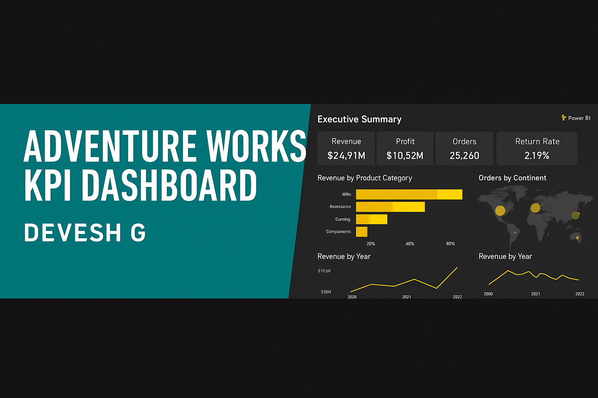

<!-- PROJECT BANNER -->
<p align="center">
  
</p>

<h1 align="center">🚴‍♂️ Adventure Works KPI Dashboard — Power BI Project</h1>
<h3 align="center">By <a href="https://www.linkedin.com/in/devesh-g-40430a253/">Devesh G</a></h3>

<p align="center">
  <a href="https://github.com/deveshd003-dj/Adventure-Works-KPI-Dashboard">
    
  </a>
  <a href="https://www.linkedin.com/in/devesh-g-40430a253/">
    
  </a>
</p>

---

## Table of Contents
- [Project Goal](#project-goal)  
- [Dashboard Preview](#dashboard-preview)  
- [Business Questions to Answer](#business-questions-to-answer)  
- [Key Insights](#key-insights)  
- [Dataset & ETL](#dataset--etl)  
- [Data Model](#data-model)  
- [Project Structure](#project-structure)  
- [Key DAX Measures](#key-dax-measures)  
- [Installation](#installation)  
- [How to Use](#how-to-use)  
- [Features](#features)  
- [Connect With Me](#connect-with-me)  
- [Author](#author)

---

## 🎯 Project Goal
Build an interactive Power BI dashboard to help Adventure Works analyze revenue, profit, orders, and returns; evaluate product and regional performance; and identify high-value customers — for **2020–2022**.

---

## 🖼️ Dashboard Preview
Add your screenshots inside the `/screenshots` folder and they will display here:


---

## 🧠 Business Questions to Answer
**Executive / High Level**
- What are total Revenue, Profit, Orders and Return Rate (2020–2022)?  
- Which product categories drive most revenue and profit?  
- Which regions (countries/continents) are the top performers?

**Product**
- Which products and subcategories miss monthly KPI targets?  
- How would a price change impact product profitability (what-if)?

**Customer**
- Who are the top high-value customers and segments by revenue?  
- Is average revenue per customer increasing or decreasing over time?

**Geography**
- Which countries and continents contribute the most orders?  
- Are there new regions showing growth potential?

---

## 📊 Key Insights (summary)
- **Total revenue** (2020–2022): **$24.9M**  
- **Total profit**: **$10.5M**  
- **Orders**: **25,200** — **Return rate**: **2.17%**  
- **Top category:** Bikes (majority of revenue)  
- 2020 decline due to **COVID-19**; recovery in 2021; slight dip in 2022 — strategy needed to reaccelerate.

---

## 🧺 Dataset & ETL
Source: **Maven Analytics (Udemy)** CSVs.  
Data prep done in **Power Query**:
- Header promotion, data typing, null handling  
- Calculated columns, trimming & standardization  
- Folder import for multi-file append  
- Remove duplicates  
- Data profiling & QA

---

## 📐 Data Model


- Star schema core; snowflake used for product lookups  
- One-to-many relationships; single-direction cross-filtering  
- Foreign keys hidden for clarity

---

## 📁 Project Structure
```text
Adventure-Works-KPI-Dashboard/
├── pbix/
│   └── AdventureWorks_KPI.pbix
├── screenshots/
│   ├── Executives.png
│   ├── Model.png
│   └── banner.png
├── data/
└── README.md
```

---

## 🧮 Key DAX Measures (Examples)
```dax
Total Revenue = SUM('Sales'[Revenue])
Total Profit = SUM('Sales'[Profit])
YTD Revenue = TOTALYTD([Total Revenue], 'Date'[Date])
Return Rate = DIVIDE([Total Returns], [Total Orders], 0)
Avg Revenue Per Customer = DIVIDE([Total Revenue], DISTINCTCOUNT('Customer'[CustomerID]), 0)
```

---

## 📦 Installation
You will need:

- **Power BI Desktop (latest version)**

---

## ▶️ How to Use
1. Download the `.pbix` file from `/pbix`  
2. Open in **Power BI Desktop**  
3. Refresh visuals or connect new data  
4. Navigate using slicers, filters & drillthrough

---

## ✨ Features
- 📊 KPI Cards & Trend Analysis  
- 🌍 Interactive Map Visuals  
- 🔁 Drillthrough Reports  
- 🎚️ What-if Pricing Parameter  
- 📈 Monthly & YoY performance  
- 🗃️ Clean Star Schema Model  
- ⚙️ Advanced DAX calculations

---

## 🤝 Connect With Me
I’d love to connect and collaborate!

- 🔗 LinkedIn: https://www.linkedin.com/in/devesh-g-40430a253/  
- 🐙 GitHub: https://github.com/deveshd003-dj

---

## 📝 Author
**Devesh G**  
_Data Analyst | Power BI Developer_
